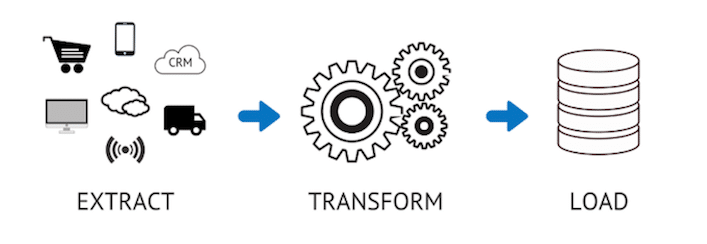

# Project 1: Data Modeling with Postgres

<p align="center"></p>

## Introduction
We are responsible for creating ETL for the analytics team at Sparkify. They were interested in analyzing data collected on songs and user activity through their new music streaming app. Currently, the data is in JSON files, we should create an ETL pipeline process to store the data in RDBMS database for easy annalysis of data.


# Available Data
### Song Dataset
The first dataset is a subset of real data from the [Million Song Dataset](https://labrosa.ee.columbia.edu/millionsong). Each file is in JSON format and contains metadata about a song and the artist of that song. The files are partitioned by the first three letters of each song's track ID. For example, here are filepaths to two files in this dataset.

Example:
```
song_data/A/B/C/TRABCEI128F424C983.json
song_data/A/A/B/TRAABJL12903CDCF1A.json
```
And below is an example of what a single song file, TRAABJL12903CDCF1A.json, looks like.
```
{"num_songs": 1, "artist_id": "ARJIE2Y1187B994AB7", "artist_latitude": null, "artist_longitude": null, "artist_location": "", "artist_name": "Line Renaud", "song_id": "SOUPIRU12A6D4FA1E1", "title": "Der Kleine Dompfaff", "duration": 152.92036, "year": 0}
```
### Log Dataset
The log dataset consists of logs of activity of users. 

Example:
```
log_data/2018/11/2018-11-12-events.json
log_data/2018/11/2018-11-13-events.json
```


# Schema for Song Play Analysis
Using the song and log datasets, you'll need to create a star schema optimized for queries on song play analysis. This includes the following tables.

#### Fact Table
1. songplays - records in log data associated with song plays i.e. records with page `NextSong`
    * songplay_id, start_time, user_id, level, song_id, artist_id, session_id, location, user_agent

#### Dimension Tables
2. <b>users</b> - users in the app
    * user_id, first_name, last_name, gender, level
3. <b>songs</b> - songs in music database
    * song_id, title, artist_id, year, duration
4. <b>artists</b> - artists in music database
    * artist_id, name, location, lattitude, longitude
5. <b>time</b> - timestamps of records in <b>songplays</b> broken down into specific units
    * start_time, hour, day, week, month, year, weekday
